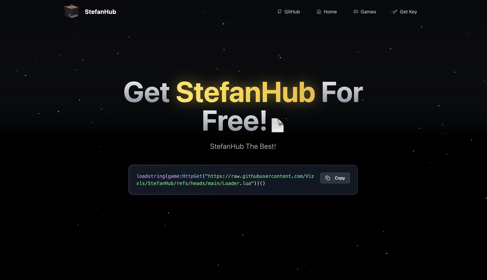

<p align="center">
  # StefanHub!
</p>


```lua
loadstring(game:HttpGet("https://raw.githubusercontent.com/Vizxls/StefanHub/refs/heads/main/Loader.lua"))()
```

<p align="center">
  <a href="https://yonpoorhub.base44.app"><b><big>Website</big></b></a>
</p>


